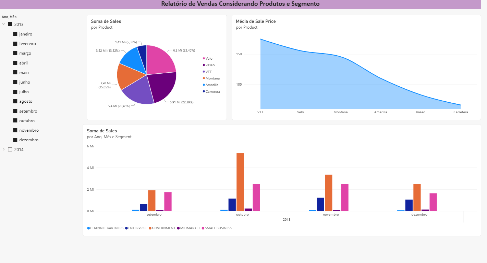
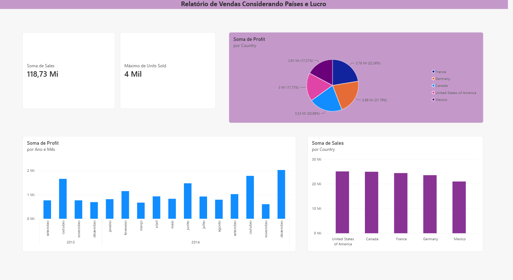
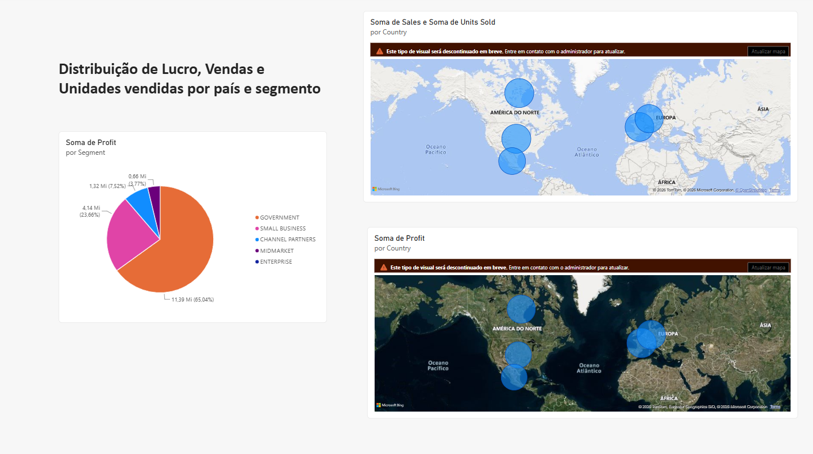

# 📊 Power BI Analyst — Desafio DIO

Projeto desenvolvido como parte do desafio do curso de **Primeiros Passos com Power BI**, da [DIO](https://www.dio.me/).

## 🎯 Sobre o projeto

O objetivo deste desafio foi desenvolver um relatório no Power BI
utilizando uma base financeira disponibilizada durante o curso,
reproduzindo duas páginas apresentadas nas aulas e criando uma
terceira página de forma independente.

O projeto teve como foco a criação e organização de visuais,
explorando diferentes formas de apresentar informações de vendas,
lucro e unidades vendidas.

## 📌 Página desenvolvida

Na terceira página do relatório foram criados os seguintes visuais:

- 🗺️ **Soma de Sales e Unidades Vendidas por País**
- 🗺️ **Soma de Profit por País**
- 🥧 **Soma de Profit por Segmento**

Também foram realizados ajustes na disposição dos visuais,
nos títulos e nas dicas de ferramentas (tooltips), buscando
tornar as informações mais claras e objetivas.

## 🛠️ Ferramentas utilizadas

- Microsoft Power BI
- Power Query
- DAX
- GitHub

## 📊 Principais análises

O dashboard permite visualizar:

- Distribuição do lucro entre os diferentes segmentos;
- Distribuição das vendas e unidades vendidas por país;
- Distribuição do lucro por país;
- Comparação entre os segmentos de negócio.

## 📂 Arquivos

| Arquivo | Descrição |
|---|---|
| `sample_financial.pbix` | Arquivo do projeto desenvolvido no Power BI |

## 📚 Referência

Projeto desenvolvido a partir do desafio proposto pela DIO.

Base e materiais de referência:
https://github.com/julianazanelatto/power_bi_analyst

## 🚀 Aprendizados

Durante o desenvolvimento deste projeto, foram praticados conceitos
relacionados à criação de relatórios no Power BI, utilização de
visuais, mapas, gráficos de pizza, configuração de campos e
organização de dashboards.

Este projeto representa uma das primeiras experiências práticas
com Power BI e faz parte da minha jornada de aprendizado na área
de Dados.

## 📊 Dashboard

### Página 1

### Página 2

### Página 3

