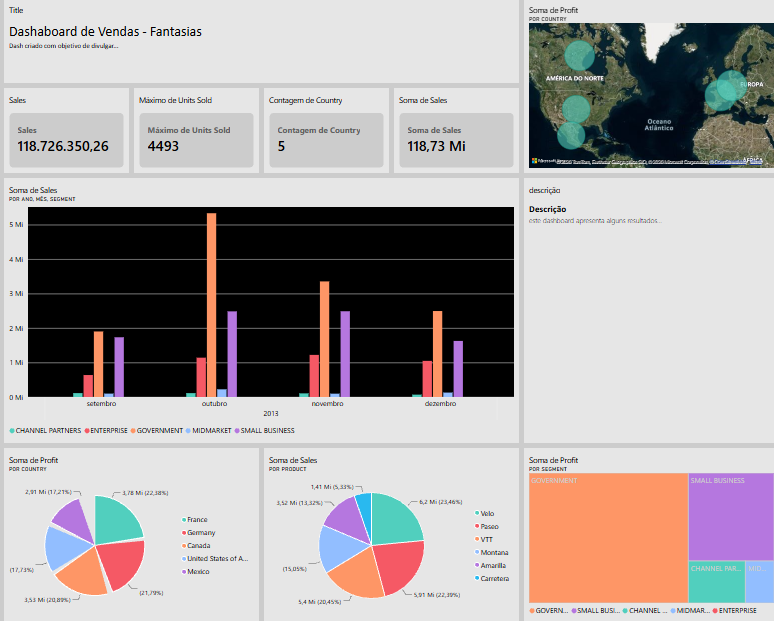

# 📊 Power BI Analyst — Desafio DIO

Projeto desenvolvido como parte do desafio do curso **Primeiros Passos com Power BI**, da [DIO](https://www.dio.me/).

## 🎯 Sobre o projeto

O objetivo deste desafio foi desenvolver um relatório no Power BI utilizando uma base financeira disponibilizada durante o curso.

O projeto consiste na reprodução de duas páginas apresentadas durante as aulas e na criação de uma terceira página de forma independente, aplicando os conhecimentos adquiridos ao longo do curso.

Durante o desenvolvimento, foram trabalhados diferentes tipos de visuais, organização das informações, títulos dos elementos visuais e configuração de campos e tooltips.

## 📌 Página desenvolvida

Na terceira página do relatório foram criados os seguintes visuais:

- 🗺️ **Soma de Sales e Unidades Vendidas por País**
- 🗺️ **Soma de Profit por País**
- 🥧 **Soma de Profit por Segmento**

Também foram realizados ajustes na disposição dos visuais, nos títulos e nas dicas de ferramentas (tooltips), buscando tornar as informações mais claras e objetivas.

## 🛠️ Ferramentas utilizadas

- Microsoft Power BI
- Power BI Desktop
- Power Query
- DAX
- GitHub

---

## 📊 Relatório

O projeto desenvolvido durante o desafio é composto por **três páginas**, apresentando diferentes visualizações e análises dos dados.

### Página 1

### Página 2

### Página 3

---

## 📈 Dashboard adicional — Análise de Vendas

Como projeto complementar ao desafio, desenvolvi um **dashboard de vendas em página única**, reunindo diferentes indicadores e visualizações para proporcionar uma visão geral dos resultados.

O dashboard apresenta informações relacionadas a:

- 💰 Vendas
- 📦 Unidades vendidas
- 🌎 Países
- 📅 Vendas por período
- 🏷️ Produtos
- 👥 Segmentos
- 📊 Lucro

> Este dashboard foi desenvolvido no Power BI Service e é apresentado no repositório por meio de uma imagem, como forma de demonstrar o resultado visual do projeto.

---

## 📂 Arquivos

| Arquivo | Descrição |
|---|---|
| `sample_financial.pbix` | Arquivo do relatório desenvolvido durante o desafio |
| `imagens/` | Imagens utilizadas para apresentar as páginas do relatório e o dashboard adicional |

## 📚 Referência

Projeto desenvolvido a partir do desafio proposto pela **DIO**.

Material de referência utilizado durante o desenvolvimento:

https://github.com/julianazanelatto/power_bi_analyst

## 🚀 Aprendizados

Durante o desenvolvimento deste projeto, foram praticados conceitos relacionados à criação de relatórios no Power BI, utilização de diferentes tipos de visuais, mapas, gráficos, configuração de campos, organização de informações e construção de dashboards.

Também foi possível praticar a publicação e organização de projetos utilizando o GitHub como ferramenta de portfólio.

Este projeto representa uma das minhas primeiras experiências práticas com Power BI e faz parte da minha jornada de aprendizado na área de Dados.
